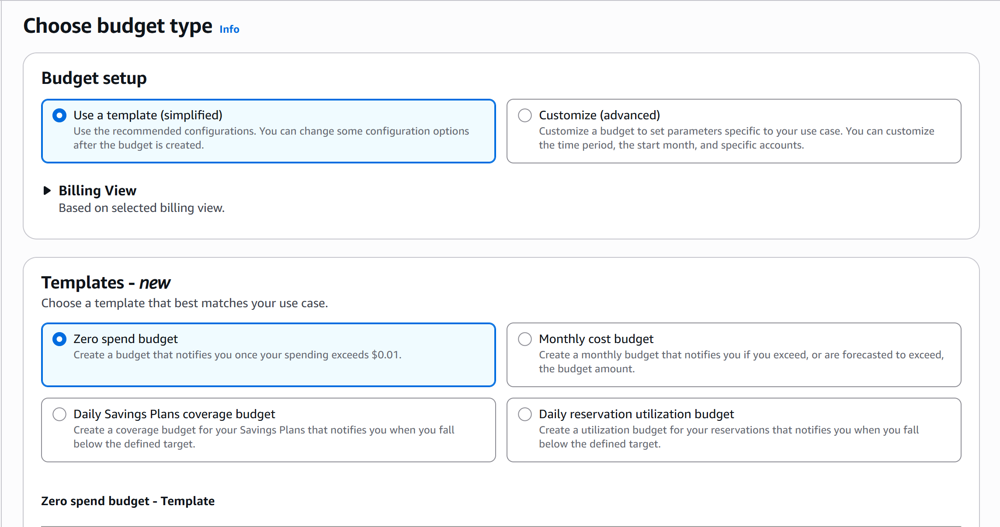
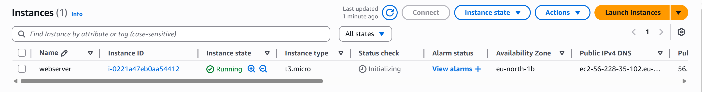
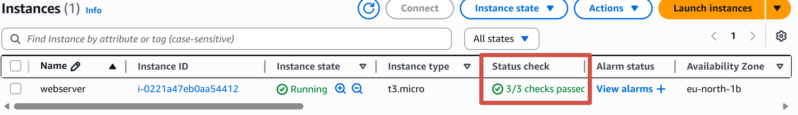
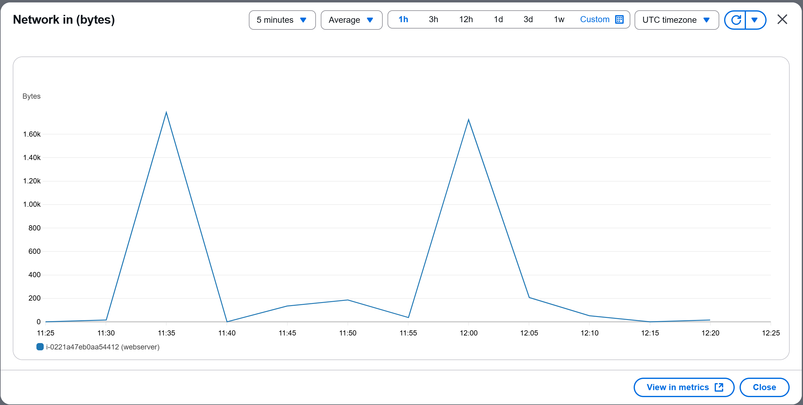
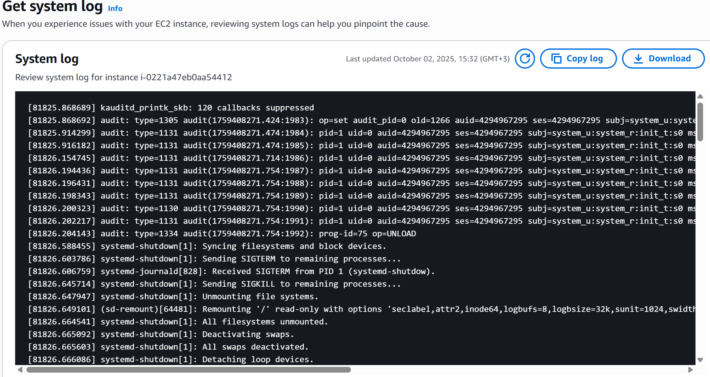
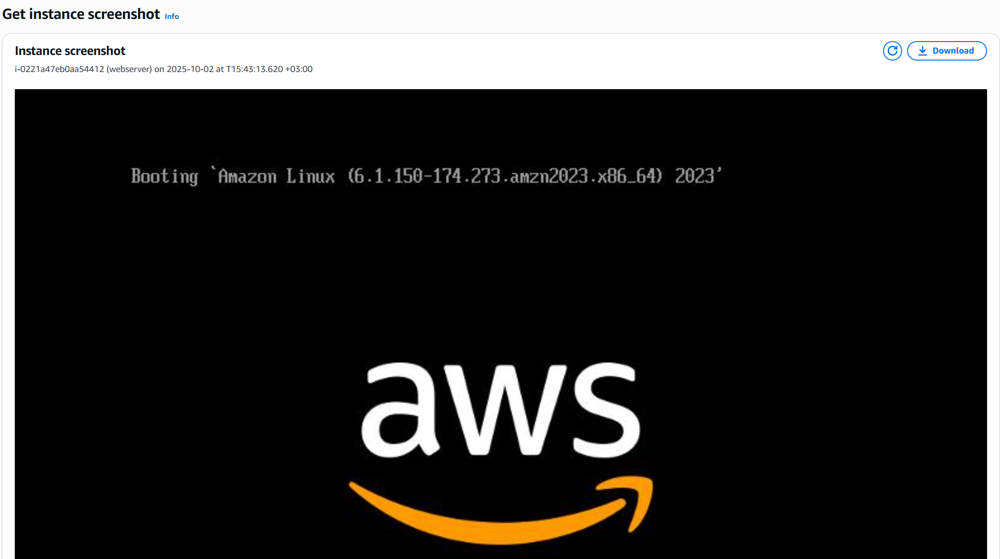
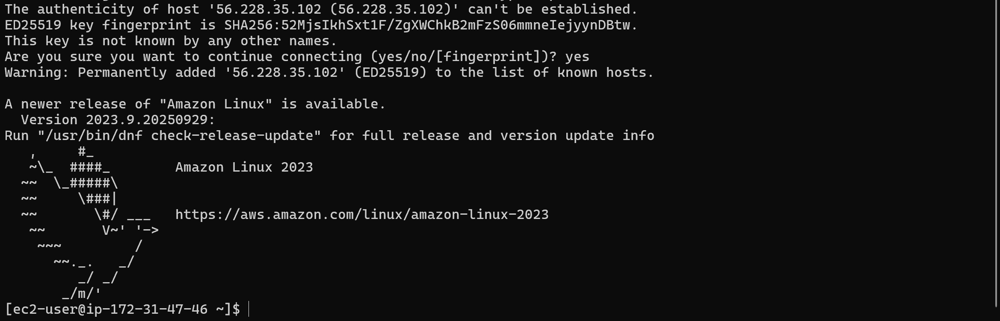
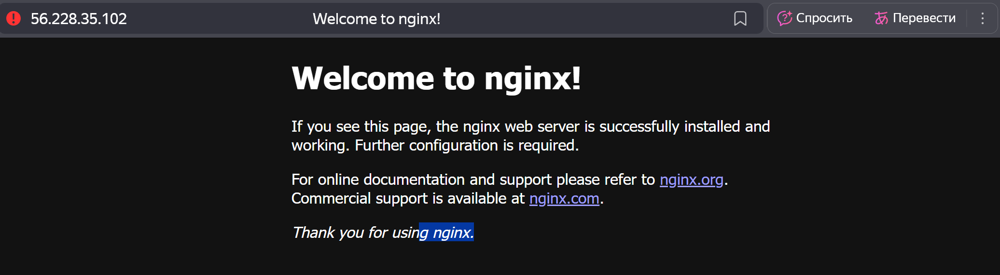
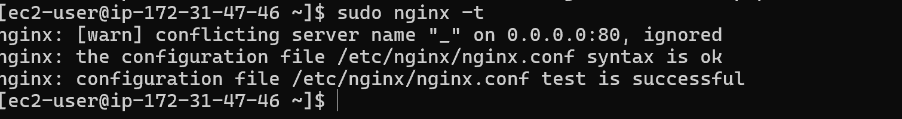
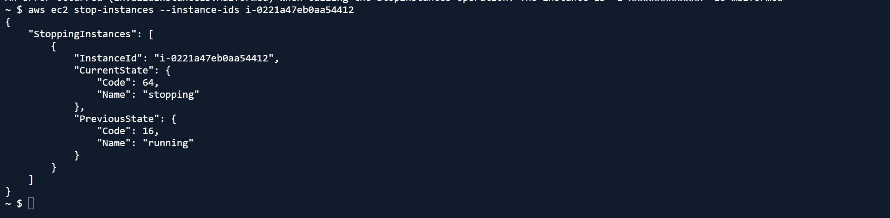

# Лабораторная работа №2: Введение в AWS. Вычислительные сервисы

## Постановка задачи

В рамках лабораторной работы необходимо ознакомиться с основными вычислительными сервисами AWS, научиться создавать и настраивать виртуальные машины (EC2), управлять доступом через IAM, а также развернуть простое веб-приложение на базе Nginx и PHP.  
Кроме того, требуется освоить базовые инструменты мониторинга и управления инстансами с помощью AWS CLI.

## Цель и основные этапы работы

**Цель работы:**  
Изучить процесс развёртывания веб-приложений в облачной среде AWS, закрепить навыки работы с EC2, IAM, Nginx и PHP-FPM, а также научиться выполнять базовое администрирование и мониторинг инстансов.

**Основные этапы работы:**

1. Регистрация и настройка AWS-аккаунта.  
2. Создание IAM-группы и пользователя с правами администратора.  
3. Настройка бюджета Zero-Spend для контроля расходов.  
4. Развёртывание виртуальной машины EC2 и установка веб-сервера Nginx.  
5. Подключение к инстансу по SSH и проверка работы сервиса.  
6. Развёртывание PHP-приложения и настройка конфигурации Nginx.  
7. Тестирование сайта и завершение работы с инстансом через AWS CLI.

## Практическая часть

### Задание 0. Подготовка среды

Проделанная работа:

1. Зарегистрирован бесплатный аккаунт **AWS Free Tier**.
2. Выполнен вход под **root-пользователем**.
3. В консоли выбран рабочий регион (**EU-North-1, Stockholm**).
4. Подготовлена консоль AWS Management Console для дальнейших шагов.

> На этом этапе сформирована базовая среда для выполнения всех следующих заданий.

### Задание 1. Создание IAM группы и пользователя

**Цель:** познакомиться с сервисом **IAM (Identity and Access Management)** и создать отдельного пользователя с ограниченными правами доступа вместо root.

**Что сделано:**

1. В сервисе **IAM** создана группа **Admins** с политикой **AdministratorAccess**, предоставляющей полный административный доступ ко всем сервисам AWS.
2. Создан пользователь **cloudstudent** и добавлен в группу **Admins**.
3. Для пользователя включён вход в **AWS Management Console** и предоставлен доступ через логин и пароль.
4. Выполнен вход под новым пользователем **cloudstudent** для дальнейшей работы(в разделе *IAM → Users* подтверждено наличие роли с правами администратора.)

#### Вопрос №1. Что делает политика `AdministratorAccess`?

Политика AdministratorAccess предоставляет пользователю полный доступ ко всем сервисам и ресурсам AWS, аналогичный root-пользователю.

### Задание 2. Настройка Zero-Spend Budget

**Цель:** настроить систему уведомлений о расходах в AWS, чтобы избежать превышения бесплатного лимита (Free Tier).

**Что сделано:**

1. В разделе **Billing → Budgets** создан бюджет по шаблону **Zero Spend Budget**.  
2. Указано имя бюджета — **ZeroSpend**, установлен лимит $0.  
3. Добавлен e-mail для уведомлений при любых расходах.  


### Задание 3. Создание и запуск EC2 экземпляра

**Цель:** развернуть виртуальную машину для веб-сервера.

**Параметры запуска:**

- **AMI:** Amazon Linux 2023
- **Instance type:** t3.micro (Free Tier)
- **Name:** `webserver`
- **Key pair:** создана пара ключей `nicolae-keypair` (`.pem` скачан локально)
- **Security Group:** `webserver-sg`
  - Inbound: **HTTP (80/tcp) — 0.0.0.0/0**, **SSH (22/tcp) — My IP**
- **Storage:** по умолчанию
- **Advanced details → User data:**

  ```bash
  #!/bin/bash
  dnf -y update
  dnf -y install htop
  dnf -y install nginx
  systemctl enable nginx
  systemctl start nginx
  ```



#### Вопрос №2. Что такое User Data и какую роль выполняет данный скрипт? Для чего используется nginx?

User Data — это специальный раздел, где можно указать скрипт, который автоматически выполняется при первом запуске виртуальной машины (EC2).
Его роль — автоматизировать настройку окружения: установка пакетов, обновления, запуск сервисов и т. д.

В данном случае скрипт:

- обновляет систему (dnf -y update),
- устанавливает утилиту мониторинга htop,
- устанавливает и запускает веб-сервер Nginx.

### Задание 4. Логирование и мониторинг

**Цель:** проверить базовые механизмы мониторинга и отладки EC2.

1. **Status checks (EC2):**
   - *System reachability* и *Instance reachability* — оба **passed (2/2)**.
2. **Monitoring (CloudWatch):**
   - Просмотр базовых метрик (CPU, Network) — режим **Basic monitoring** (5-минутные интервалы).
3. **System Log:**
   - Actions → Monitor and troubleshoot → **Get system log** — просмотрел вывод консоли загрузки (ядро, cloud-init, запуск сервисов).
4. **Instance Screenshot:**
   - Actions → Monitor and troubleshoot → **Get instance screenshot** — снимок экрана консоли на случай недоступности по SSH.





#### Вопрос №3. В каких случаях важно включать детализированный мониторинг?

Детализированный мониторинг включают, когда нужна точная и частая статистика — например, для авто-масштабирования, анализа производительности или оперативного реагирования на сбои.

### Задание 5. Подключение к EC2 по SSH

**Цель:** получить доступ к серверу для администрирования.

**Подключение (Windows PowerShell):**

```bash
ssh -i "<путь до моего keypair.pem>" ec2-user@<Public-IP сервера>
```



#### Вопрос №4. Почему в AWS нельзя использовать пароль для входа по SSH?

В AWS вход по SSH выполняется только по ключу (.pem), потому что это безопаснее, чем пароли: ключ невозможно подобрать перебором, а пароль — можно.

### Задание 6b. Развёртывание веб-сайта на PHP (Nginx + PHP-FPM)

**Цель:** разместить PHP-сайт и настроить обработку PHP через PHP-FPM.

1) **Копирование файлов сайта на сервер**

```bash
# c локального ПК во временную папку на сервере
scp -i "<путь до моего keypair.pem>" -r "<путь до моего php-проекта>" ec2-user@<публичный адрес сервера>:/tmp/site/

# на сервере - перемещение в корень проекта (так безопснее и надежнее загружать файлы на сервер)
sudo mkdir -p /usr/share/nginx/html
sudo cp -r /tmp/site/* /usr/share/nginx/html/
sudo chown -R nginx:nginx /usr/share/nginx/html
sudo chmod -R 755 /usr/share/nginx/html

# Установка Nginx и PHP-FPM
sudo dnf -y install nginx php php-fpm php-cli php-mysqlnd
sudo systemctl enable nginx && sudo systemctl start nginx
sudo systemctl enable php-fpm && sudo systemctl start php-fpm
```

Проверка сервиса Nginx: `systemctl status nginx` (active).


Конфигурация Nginx `mywebsite.conf` для PHP сделана по примеру из курса с созданием бэкапа:

```bash
    server {
  listen 80;
  server_name _;

  root /usr/share/nginx/html;
  index index.php index.html index.htm;

  location / {
      try_files $uri $uri/ =404;
  }

  location ~ \.php$ {
      include snippets/fastcgi-php.conf;
      fastcgi_pass unix:/run/php-fpm/www.sock;
  }

  location ~ /\.ht {
      deny all;
  }
}
```

После чего файл конфигурации был загруже на сервер в директорию `/etc/nginx/conf.d/` командами:

```bash
scp -i yournickname-keypair.pem mywebsite.conf ec2-user@<Public-IP>:/tmp
ssh -i yournickname-keypair.pem ec2-user@<Public-IP> "sudo mv /tmp/mywebsite.conf /etc/nginx/conf.d/"
```

Командой `sudo nginx -t` убедился что ошибок нет.




#### Вопрос №5. Что делает данный конфигурационный файл mywebsite.conf?

Этот конфигурационный файл задаёт правила, по которым Nginx обслуживает сайт:

- listen 80 — сервер слушает HTTP-запросы на порту 80;
- root /usr/share/nginx/html — задаёт корневую папку сайта;
- index index.php... — определяет, какие файлы считать главными;
- location / — обрабатывает обычные запросы к страницам;
- location ~ .php$ — перенаправляет PHP-файлы в PHP-FPM для выполнения;
- deny all для .ht* — запрещает доступ к скрытым файлам.

### Задание 7. Завершение работы (остановка EC2 через AWS CLI)

**Цель:** корректно остановить виртуальную машину без удаления диска/данных.

Через CloudShell в AWS Console остановил сервер командой `aws ec2 stop-instances --instance-ids i-0221a47eb0aa54412`



#### Вопрос №6. Чем «Stop» отличается от «Terminate»?

Stop — временно останавливает инстанс: он выключается, но диск и данные сохраняются, и его можно запустить снова.
Terminate — полностью удаляет инстанс: диск и все данные стираются безвозвратно.

## Выводы

В ходе лабораторной работы была успешно развернута и настроена виртуальная машина на платформе **Amazon Web Services (AWS)** с использованием сервиса **EC2**.  
В процессе работы студент ознакомился с ключевыми инструментами управления облачной инфраструктурой — от создания IAM-пользователя и настройки бюджета до мониторинга и администрирования экземпляра.

В практической части была выполнена установка и настройка веб-сервера **Nginx** и интерпретатора **PHP-FPM**, реализовано копирование и размещение PHP-приложения, а также произведена проверка его корректной работы по публичному IP-адресу. Конфигурация Nginx была адаптирована под среду Amazon Linux 2023, что позволило корректно обрабатывать PHP-скрипты.

Кроме того, работа включала знакомство с механизмами логирования и мониторинга AWS, а также применение **AWS CloudShell (CLI)** для управления виртуальной машиной с помощью командной строки. В частности, была выполнена остановка инстанса через CLI с сохранением данных и конфигурации.

Таким образом, цель лабораторной работы достигнута: были изучены основы вычислительных сервисов AWS, принципы настройки EC2 и развертывания веб-приложений в облачной среде. Полученные навыки могут быть использованы для дальнейших работ, связанных с автоматизацией, DevOps-практиками и управлением веб-инфраструктурой.

## Список использованных источников

1. [Официальная документация AWS](https://docs.aws.amazon.com/) — материалы по настройке сервисов EC2, IAM и работе с AWS CLI.  
2. [Amazon Linux 2023 Documentation](https://docs.aws.amazon.com/linux/al2023/) — руководство по установке и настройке пакетов в Amazon Linux.  
3. [Nginx Official Documentation](https://nginx.org/en/docs/) — справка по настройке веб-сервера и обработке PHP через FastCGI.  
4. [Chat GPT](https://chatgpt.com) - Консультация и помощь в решении проблем, появившихся в ходе выполнения работы

## Дополнительные аспекты

> В Amazon Linux 2023 нет `snippets/fastcgi-php.conf`, поэтому использовал `fastcgi.conf` в конфигурационном файле.
