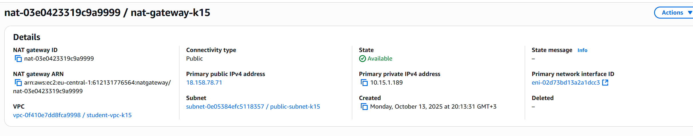

# Лабораторная работа №3. Облачные сети (AWS VPC)

## 1. Описание лабораторной работы

Реализовать изолированную виртуальную сеть в AWS (VPC) с двумя подсетями (public/private), Internet Gateway (IGW), NAT Gateway, отдельными таблицами маршрутов и тремя EC2-инстансами:

### Цели

- Понять изоляцию сетей в AWS (границы VPC).
- Научиться создавать и связывать: **VPC, Subnet, Route Table, IGW, NAT Gateway, Security Group**.
- Разобраться, как взаимодействуют EC2 в разных подсетях.
- Отстроить публичные и приватные маршруты.

**Этапы:**

1) Создать VPC `student-vpc-k15` (CIDR `10.15.0.0/16`, регион `eu-central-1`).  
2) Подсети: `public-subnet-k15` (`10.15.1.0/24`) и `private-subnet-k15` (`10.15.2.0/24`).  
3) IGW + public route table (`0.0.0.0/0 → IGW`).  
4) NAT Gateway + private route table (`0.0.0.0/0 → NAT`).  
5) SG для web/bastion/db с нужными правилами.  
6) EC2 (Amazon Linux 2, t3.micro) и проверка доступности: браузер → web, SSH → bastion, с bastion → MySQL на db.

### Результат

- Публичная подсеть с web-сервером (HTTP доступ извне).
- Приватная подсеть с БД (без прямого входа из интернета).
- Bastion host в публичной подсети для админ-доступа к приватным ресурсам.
- NAT GW для исходного интернета из приватной подсети.

## 2. Архитектура (схема)

## 3. Пошаговое выполнение

### Шаг 1. Подготовка

- Вошел в **AWS Console**, выбрал регион **Frankfurt (eu-central-1)**.
- Открыл сервис **VPC**.

### Шаг 2. Создание VPC

Я вошёл в консоль AWS в регионе **Frankfurt (eu-central-1)** и создал собственную виртуальную сеть. Задал имя **student-vpc-k15** и адресное пространство **10.15.0.0/16** при **Tenancy: Default**.

### Шаг 3. Internet Gateway (IGW)

Я создал Internet Gateway с именем **student-igw-k15** и прикрепил его к своей VPC **student-vpc-k15**. Тем самым я обеспечил выход трафика из публичной части сети в Интернет и обратную маршрутизацию ответов. Без IGW публичные IP у инстансов не имели бы смысла — пакеты не покидали бы границы VPC.

### 4. Создание подсетей

Я создал две подсети в своей VPC:

- **public-subnet-k15** с адресом `10.15.1.0/24` — для веб-сервера,  
- **private-subnet-k15** с адресом `10.15.2.0/24` — для базы данных.  

На этом этапе обе подсети были просто логически разделены, без маршрутов и статусов «публичная/приватная».

### 5. Таблицы маршрутов

Я создал две таблицы маршрутов:

- **public-rt-k15** — добавил маршрут `0.0.0.0/0 → Internet Gateway` и привязал её к публичной подсети;  
- **private-rt-k15** — связал с приватной подсетью без внешнего маршрута.  

Так я разделил трафик: публичные ресурсы получили доступ в Интернет, а приватные остались изолированными.

### 6. NAT Gateway

Я выделил **Elastic IP** и создал **NAT Gateway** в публичной подсети, указав этот EIP. После активации добавил маршрут `0.0.0.0/0 → NAT Gateway` в таблицу **private-rt-k15**. Теперь ресурсы из приватной подсети могли выходить в Интернет, не раскрывая свои внутренние IP-адреса.

### 7. Группы безопасности (Security Groups)

Я создал три группы безопасности:

- **web-sg-k15** — разрешил вход по HTTP (80) и HTTPS (443) из любого источника;  
- **bastion-sg-k15** — открыл порт SSH (22) только для моего IP;  
- **db-sg-k15** — разрешил доступ к MySQL (3306) с `web-sg-k15` и SSH (22) с `bastion-sg-k15`.  

Так я обеспечил минимально необходимый уровень доступа между компонентами сети.

## 8. Создание EC2-инстансов

Я развернул три экземпляра EC2 на базе t3.micro:  

- **web-server** — в публичной подсети, с публичным IP и группой `web-sg-k15`;  
- **db-server** — в приватной подсети, без публичного IP, с группой `db-sg-k15`;  
- **bastion-host** — в публичной подсети, с публичным IP и группой `bastion-sg-k15`.  

Для web-server добавил в user data установку Apache и PHP, для db-server — MariaDB, а для bastion-host — клиента MariaDB.

## 9. Проверка работы

После запуска всех инстансов я открыл публичный IP веб-сервера и увидел страницу с информацией PHP, что подтвердило его доступность из Интернета.

Затем подключился по SSH к **bastion-host**  командой `ssh -i MyKeyPair.pem ec2-user@1<Public Ip Bastion>` и успешно проверил интернет через `ping google.com`.

Из bastion-хоста подключился к **db-server** по внутреннему адресу через MySQL используя команду `mysql -h <DB-Server-Private-IP> -u root -p` — соединение прошло успешно, что подтвердило корректную настройку маршрутов и групп безопасности.

### 10. Завершение

После проведенной работы все instanes и связанные с ними данные были успешно удалены.

## 11. Выводы

В ходе работы я создал изолированную сеть **VPC** с публичной и приватной подсетями, настроил **Internet Gateway** и **NAT Gateway**, таблицы маршрутов и группы безопасности. Развернул три EC2-инстанса с различными уровнями доступа и проверил их взаимодействие. В результате сеть функционирует корректно: веб-сервер доступен из Интернета, а база данных — только через bastion-host.

## Контрольные вопросы

**1 Что обозначает маска /16? И почему нельзя /8?**
`/16` — это префикс сети, оставляет 16 бит под адреса хостов (диапазон ~65k адресов), удобно для разбиения на /24 подсети. `/8` даёт ~16 млн адресов — это избыточно, блокирует крупный диапазон RFC1918, усложняет планирование и в AWS может конфликтовать с лимитами/другими сетями (включая будущие peering/Transit). Рекомендуемый размер VPC — /16 или /20.

**2. Является ли подсеть "приватной" на данный момент? Почему?**  
Нет, на этом этапе подсеть ещё не является приватной. Она становится приватной только после привязки к таблице маршрутов, где отсутствует прямой маршрут в Интернет (через IGW). Пока такой маршрут не задан, подсеть остаётся обычной внутренней.

**3. Зачем необходимо привязать таблицу маршрутов к подсети?**  
Потому что таблица маршрутов не применяется ко всей VPC автоматически — она действует только для тех подсетей, которые к ней привязаны. Без ассоциации подсеть будет использовать основную (main) таблицу маршрутов, а не ту, которую мы создали вручную.

**4. Как работает NAT Gateway?**  
NAT Gateway подменяет исходные частные IP-адреса инстансов в приватной подсети на свой публичный IP (Elastic IP). Благодаря этому ресурсы из приватной зоны могут обращаться к Интернету, но внешние пользователи не могут инициировать соединение в обратную сторону.

**5. Что такое Bastion Host и зачем он нужен в архитектуре с приватными подсетями?**  
Bastion Host — это промежуточный сервер (jump host) в публичной подсети, через который администратор подключается к приватным инстансам по SSH. Он служит точкой входа в изолированную часть сети, обеспечивая безопасность и контроль доступа.
