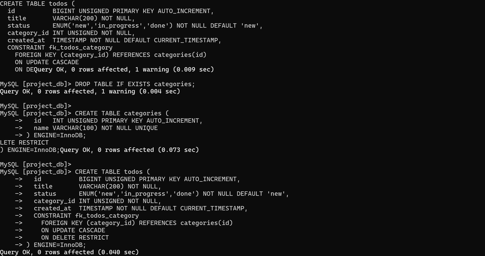
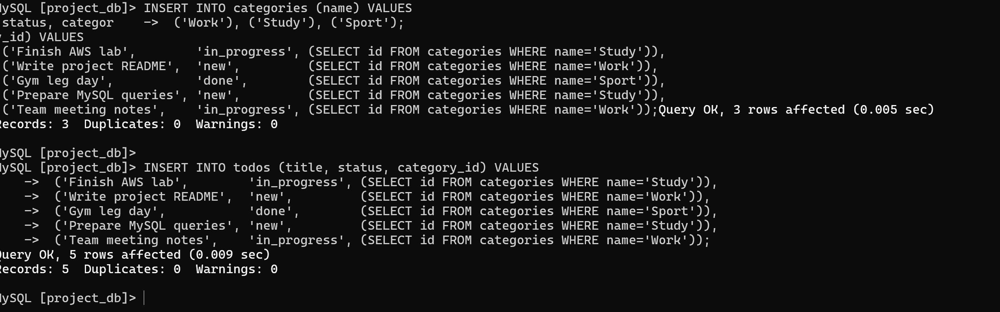
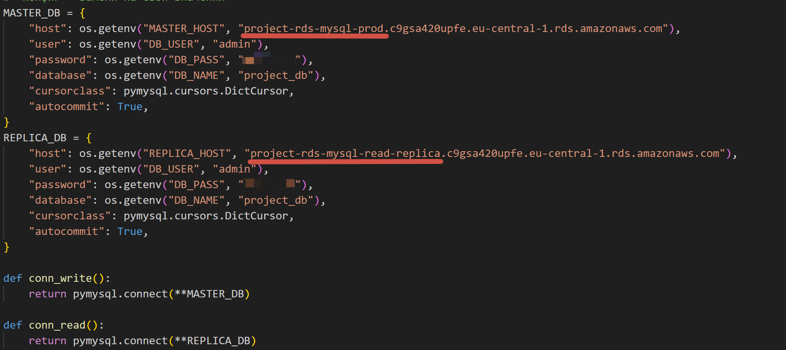
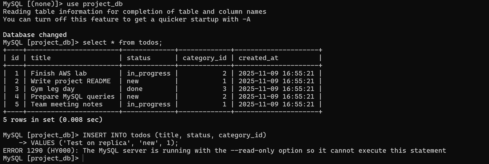
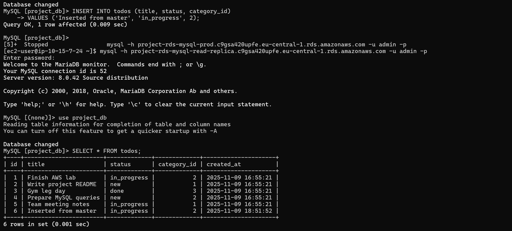
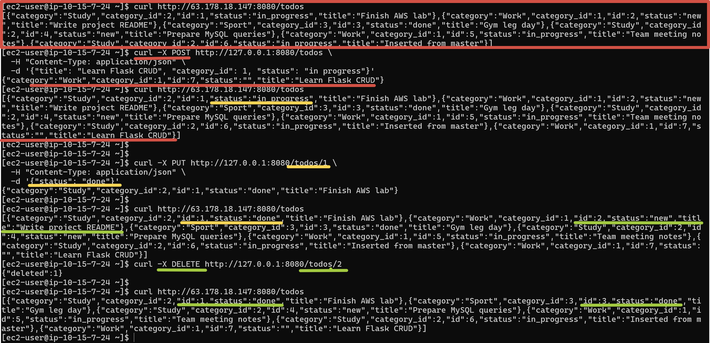

# Лабораторная работа №5. Облачные базы данных: Amazon RDS, DynamoDB

## 1. Описание лабораторной работы

### 1.1 Постановка задачи

- Спроектировать изолированную сетевую среду в AWS (VPC, подсети, маршрутизация, Internet Gateway, Security Groups).
- Развернуть реляционную СУБД в Amazon RDS (MySQL) и подготовить Read Replica.
- Создать виртуальную машину EC2 в публичной подсети и подключить её к RDS.
- Выполнить базовые операции с данными (CRUD): создание, чтение, обновление, удаление.
- Продемонстрировать раздельное использование master-инстанса (для записи/изменений) и read-replica (для чтения).
- Подготовить отчёт с пояснениями и скриншотами.

### 1.2 Цель и основные этапы работы

**Цель:** познакомиться с управляемыми реляционными базами данных в AWS (Amazon RDS), научиться подключать приложения к базе, масштабировать чтение через Read Replica и понимать сетевую/безопасностную обвязку.

**Этапы:**

1. **Подготовка среды (VPC/подсети/SG):**
   - Создание VPC `project-vpc` с исопльзованием мастера создания VPC.
   - Настройка Security Group для приложения `web-security-group` (вход: 22/80/8080; исход: доступ в интернет) и SG для БД `db-mysql-security-group` (вход: 3306 только от `web-security-group`).

2. **Развёртывание Amazon RDS (MySQL):**
   - Развёртывание DB instance
   - Отключение Public access (БД доступна только из приватной сети).

3. **Создание Read Replica:**
   - Запуск реплики для основного инстанса RDS.
   - Проверка работы реплики.

4. **EC2**
   - Поднятие EC2 в публичной подсети, привязка `web-security-group`.
   - Подключение к серверу базы данных с сервера EC2.

5. **Работа с данными:**
   - Создание БД/таблиц (например, `categories` и `todos`) со связью 1 ко многим.
   - Вставка тестовых записей, выполнение выборок и `JOIN`.
   - Проверка запрета записи на реплику и появления новых данных на реплике после вставки в master.

6. **Подключение приложения**
    - Установка необходимых пакетов (Python 3, pip, драйвер `PyMySQL`), развёртывание минимального Flask-приложения.
    - Настройка подключения к **master** (операции записи/обновления/удаления) и к **read-replica** (операции чтения).

7. **Отчёт:**
   - Пошаговое описание конфигурации с иллюстрациями.
   - Ответы на контрольные вопросы.

## 2. Практическая часть

### 2.1 Подготовка среды (VPC, подсети, Security Groups)

1. В консоли AWS создана новая VPC `project-vpc` с CIDR-блоком `10.15.0.0/16`.
2. Так как использовался мастер построения VPC, были автоматически созданы 4 подсети(по 2 публичные и приватные), таблицы маршрутизации и igw.
3. Созданы группы безопасности:
   - **web-security-group** — для EC2-приложения:
   - **db-mysql-security-group** — для базы данных:

### 2.2 Развёртывание Amazon RDS (MySQL)

1. Создана **DB Subnet Group** `project-rds-subnet-group`, включающая две приватные подсети.  
2. В консоли RDS создан новый инстанс
3. После запуска инстанса получен endpoint бд.
4. Проверено подключение с EC2:

    ```bash
    mysql -h project-rds-mysql-prod.xxxxxx.eu-central-1.rds.amazonaws.com -u admin -p
    ```

5. Создана база project_db, которая позже будет использоваться для создания реплики, затем таблицы todos & categories со связью 1 ко многим.

   

   Также вставленны тестовые данные

   

### 2.3 Создание Read Replica

1. В консоли RDS выбрана `Create read replica`.

2. **Настроена реплика:**
    - DB identifier: project-rds-mysql-replica
    - Instance class: db.t3.micro
    - Storage type: General Purpose SSD (gp3)
    - Public access: Disabled
    - VPC security group: db-mysql-security-group
3. Проверено подключение с EC2:
    `mysql -h project-rds-mysql-read-replica.c9gsa420upfe.eu-central-1.rds.amazonaws.com -u admin -p`.

    Реплика работает в режиме read-only — запросы SELECT выполняются, INSERT/UPDATE/DELETE вызывают ошибку.

### 2.4 Создание EC2 и настройка подключения

1. Создана виртуальная машина EC2 (Amazon Linux 2023, тип t3.micro) в публичной подсети.
2. Привязана группа безопасности web-security-group.
3. Подключение по SSH: `ssh -i key.pem ec2-user@<public_ip>`
4. Установлены необходимые пакеты:

   ```bash
   sudo dnf update -y
   sudo dnf install -y python3 python3-pip
   pip3 install flask pymysql
   ```

5. Для демонстрации работы было создано пиложение на Flask, подключающееся к RDS.
   Подключение проиходит к master для записи, и на тчение к Replica.

### 2.5 Развёртывание CRUD-приложения и тестирование

#### 1. Создание и запуск Flask-приложения

На виртуальной машине EC2 был создан файл `app1.py` (его содержимое можно будет найти на github).
В данном приложении определены конфиги реплики и мастера, и нужный выбирается по типу запроса.
Read - replpica, Write - master.


1. Проверим, что через реплику можно читать данные, но нельзя вставить и изменять
   

   Как видно на скриншоте, у нас 5 записей и запрос на вставку новой был отклонен.

2. Вставка записи с оригинала
   

   Как видно, новая запись была успешно вставленна с оригинала и диначиски данные подтянулись в реплику.

3. Демонстрация CRUD функционала
   

   Как видно из данного изображения, данные успешно вставляются/изменяются и удаляются.
   Стоит отметить, что все запросы на вставку/изменение/удаление данных обрабатываются master-инстансом, а все запросы на чтение - репликой, так как это определено конфигом.

## Выводы

1. Flask-приложение успешно выполняет CRUD-операции с базой RDS.
2. Операции записи происходят на master instance, операции чтения — с read replica.
3. Read Replica синхронизируется с master автоматически.
4. Архитектура обеспечивает масштабируемость и отказоустойчивость приложения.

## Ответы на вопросы

1. Что такое Subnet Group? И зачем необходимо создавать Subnet Group для базы данных?

   Subnet Group - это набор подсетей в разных зонах доступности внутри VPC, куда Amazon RDS может размещать свою бд.
   Нужна для:
      - указывает RDS, где именно в VPC создавать базу
      - обеспечивает высокую доступность (AZ redundancy)
      - позволяет держать БД в приватных подсетях (без доступа из интернета)
2. Подключитесь к Read Replica с вашей виртуальной машины EC2 и выполните запросы на чтение данных (SELECT) из таблиц, созданных на основном экземпляре базы данных. Какие данные вы видите? Объясните почему.
   Вижу все созданные таблицы и содержащиеся в них данные. Реплика создана с политикой read-only, так что ей позволены запросы на чтение с оригинала.
3. Попробуйте выполнить запрос на запись (INSERT/UPDATE) на реплике. Получилось ли выполнить запись на Read Replica? Почему?
   Аналогично как в пунте выше (см. пункт 2) - у нее политика разрешающая только чтение, поэтому любые запросы на вставку/обновление/удаление данных возвращают ошибку.
4. Перейдите на основной экземпляр базы данных и добавьте новую запись в одну из таблиц. Вернитесь к подключению к Read Replica и выполните запрос на чтение. Отобразилась ли новая запись на реплике? Объясните почему.
   Да, новые данные отобразились на реплике, так как она асинхронно копирует данные с мастера.
