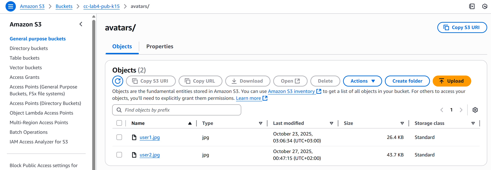

# Лабораторная работа №4 Облачное хранилище данных. Amazon S3

## Цели работы

- Освоить объектное хранилище AWS S3 и типовые операции администрирования/эксплуатации.
- Научиться создавать/организовывать бакеты
- Научиться настраивать доступ к бакетам
- Узнать, как настроить статический веб-хостинг на базе S3
- Понять принципы версионирования и жизненых циклов объектов

### 1.1 Постановка задачи

Реализовать базовую инфраструктуру в Amazon S3: создать публичный и приватный бакеты, загрузить и организовать объекты через Console и AWS CLI (под пользователем `s3-uploader`), настроить шифрование по умолчанию и версионирование, включить Static Website Hosting для отдельного бакета, задать Lifecycle-правила для архивирования логов, проверить доступность публичных объектов и недоступность приватных, подготовить короткий отчёт с ответами на контрольные вопросы.

### 1.2 Основные этапы работы

1) Создание двух бакетов: `cc-lab4-pub-k15` (публичный контент) и `cc-lab4-priv-k15` (приватные логи), Object Ownership: Bucket owner enforced, SSE-S3.
2) Загрузка объектов через Console (user1.jpg, logo.png, content/index.html) и через AWS CLI (user2.jpg, activity.csv) от имени профиля `s3-uploader`.
3) Настройка публичного чтения для префиксов `avatars/*` и `content/*` (bucket policy), проверка ссылок; приватный бакет — недоступен извне.
4) Включение Versioning и демонстрация появления новой версии при перезаливке.
5) Настройка Lifecycle в приватном бакете: переход `logs/*` → Standard-IA (30 дней), → Glacier Deep Archive (365 дней), Expiration (1825 дней).
6) (Опц.) Создание отдельного бакета для Static Website Hosting и публикация `index.html`.

## 2.1 Пошаговое выполнение

### Подготовка

- Регион: `eu-central-1`. Имена: `cc-lab4-pub-k15`, `cc-lab4-priv-k15`.
- AWS CLI v2 установлен; профиль: `s3-uploader` (`aws configure --profile s3-uploader`).


### Шаг 1 — Создание бакетов (Console)

На первом шаге создал 2 бакета, приватный для логов и публичный - для общедоступных данных для пользователей (аватары и т.д)

1) S3 → Create bucket → имя `cc-lab4-pub-k15` → Object Ownership: **Bucket owner enforced (ACLs disabled)** → Default encryption: **SSE-S3** → Create.  
2) Аналогично `cc-lab4-priv-k15`.  

### Шаг 2 — Публичный доступ (Bucket policy)

Для публичного бакета настроил доступ из публичных источников, чтоб пользователи могли "читать" из них. Для этого прописал политиику бакета (ниже скрипт)

- В `cc-lab4-pub-k15` снят блок **Block public access** (разрешить политики).
- Bucket policy (чтение для префиксов `avatars/*` и `content/*`):

```json
{
  "Version": "2012-10-17",
  "Statement": [{
    "Sid": "AllowPublicRead",
    "Effect": "Allow",
    "Principal": "*",
    "Action": "s3:GetObject",
    "Resource": [
      "arn:aws:s3:::cc-lab4-pub-k15/avatars/*",
      "arn:aws:s3:::cc-lab4-pub-k15/content/*"
    ]
  }]
}
```

### Шаг 3 — Загрузка объектов через Console

1) Публичный бакет `cc-lab4-pub-k15`:
   - Папка `avatars/` → Upload → `user1.jpg`.
   - Папка `content/` → Upload → `logo.png`, `index.html`.
   - Для проверки объект открыт по URL (для `avatars/*` и `content/*` даёт картинку/страницу). (скрины ниже)

### Шаг 4 — Загрузка объектов через AWS CLI

При загрузке изображений, как узнал, хорошая практика это - указывать content-type, так как по умолчанию сохраняется "octet-stream", что может помешать корректному отображению изображения в будущем. Поэтому сразу указывал тип контента загружаемого.

```powershell
# загрузка аватара в публичный бакет
aws s3 cp s3://cc-lab4-pub-k15/avatars/user2.jpg --content-type image/jpeg --profile s3-uploader

# загрузка логов в приватный бакет
aws s3 cp s3://cc-lab4-priv-k15/logs/activity.csv  --content-type text/csv --profile s3-uploader
```




### Шаг 5 — Проверка доступа к объектам

Публичные материалы доступны по URL. На попытку открыть приватные получаем ошибку доступа. Все как и положено.

1) Публичный объект:
   - `https://cc-lab4-pub-k15.s3.eu-central-1.amazonaws.com/avatars/user2.jpg`

2) Приватный объект (`AccessDenied`):
   - `https://cc-lab4-priv-k15.s3.eu-central-1.amazonaws.com/logs/activity.csv`


### Шаг 6 — Включение версионирования и проверка

В обоих бакетах включил: **Properties → Bucket Versioning → Enable**.
Оно позволяет отслеживать изменения состояния хранимых объектов. Как видно из скрина ниже, после замены файла, его история изменений сохранилась в отдельной вкладке.


### Шаг 7 — Lifecycle-правила (архивирование логов в приватном бакете)

Lifecycle позволяет контролировать жизненый цикл объектов, вовремя их отправляя в архив, в временную мусорную корзину или же удаляеть их с дисков. Весьма удобный инструмент для атоматизации регулирования содержимого бакетов.

1) Консоль: `cc-lab4-priv-k15` → **Management → Lifecycle rules → Create rule**  
   Name: `logs-archive`, Scope: `Prefix` = `logs/`.

2) Actions (Transitions & Expiration):  
   - Transition to **Standard-IA**: after **30** days  
   - Transition to **Glacier Deep Archive**: after **365** days  
   - **Expiration (Delete)**: after **1825** days


### Шаг 8 — Static Website Hosting для публичного контента

Бакеты s3 позволяют быстро и безболезнено развернуть веб-сайт. Однако, несмотря на быстроту и легкость настройки, для полноценных сайтов рекомендуется исопльзовать специализорованные хостинги, так как они предоставляют большую гибеость при настройке.

1) В бакете `cc-lab4-pub-k15`: **Properties → Static website hosting → Enable**  
   - Index document: `index.html`  

2) Проверка: открыл веб-страницу по url, где все работает восхитительно:
   `http://cc-lab4-web-k15.s3-website.eu-central-1.amazonaws.com`


### Шаг 9 — Контрольные вопросы

1) **Чем S3 отличается от EBS/EFS?**  
   S3 — объектное хранилище (объекты в бакетах, высокая долговечность, дешево за GB).  
   EBS — блочное (диски для EC2, низкая латентность).  
   EFS — файловое (общая POSIX-ФС по сети для многих инстансов).

2) **Как сделать объект публично доступным «по-современному»?**
   Через **bucket policy** (GetObject на нужный префикс) при отключённых ACL (Object Ownership: Bucket owner enforced). BPA должен не блокировать публичные политики.

3) **Зачем Versioning?**  
   Хранит несколько версий объекта и позволяет откатиться/восстановить удалённые.

4) **Что делает Lifecycle?**
   Автоматически переводит/удаляет объекты по времени (например, в IA/Glacier/удаление) для экономии.

5) **Зачем `Content-Type`?**
   Корректный MIME-тип для отдачи в браузере (иначе загрузка как бинарник).

6) **Где включить шифрование?**
   **Default encryption** на бакете (SSE-S3 или SSE-KMS). Тогда все новые объекты шифруются автоматически.

## Список используемых источников

- `https://elearning.usm.md/mod/assign/view.php?id=317871`

- `https://github.com/MSU-Courses/cloud-computing/blob/main/_lab/04_Cloud_Storage/advanced.md`

## Выводы

В ходе работы освоены ключевые возможности Amazon S3: создание публичных и приватных бакетов, управление доступом через bucket policy (вместо ACL), загрузка и организация объектов через Console и AWS CLI. Включены шифрование по умолчанию и версионирование — это повышает безопасность и позволяет откатывать изменения. Настроены Lifecycle-правила для автоматического перевода и удаления «старых» данных, что снижает стоимость хранения. Проверены сценарии доступа: публичные объекты корректно отдаются по ссылкам, приватные остаются закрытыми. В целом, задачи полностью решены и выполены, что продемонстрированно скринами.
